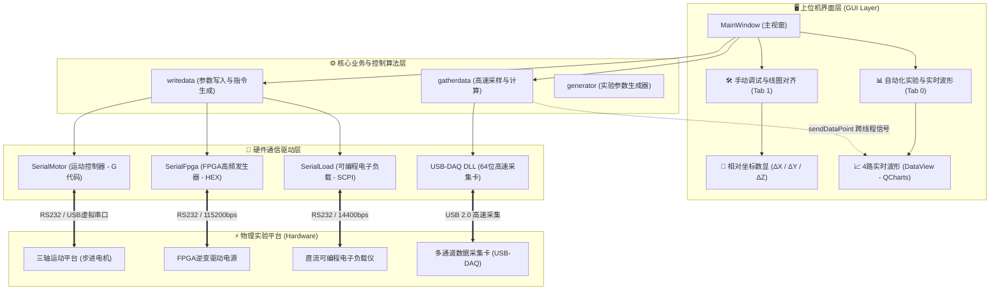

# 无线电能传输 (WPT) 自动化测试系统 v2.0

<p align="center">
  
</p>

<p align="center">
  <b>面向无线电能传输 (WPT) 的自动化测控、实时波形监控与多轴线圈对齐上位机系统</b>
</p>

<p align="center">
  
  
  
  
  
</p>

---

## 📖 项目简介

**WPT 自动化测试系统 v2.0** 是一套专为无线电能传输（Wireless Power Transfer, WPT）实验与研发设计的综合测控上位机平台。系统集成了**多轴步进电机运动平台**、**FPGA 高频逆变发生器**、**可编程电子负载仪**与 **USB-DAQ 多通道高速同步采集卡**，实现了从实验参数自动生成、硬件协同控制、高速动态采样、4 路波形实时渲染到测试数据自动封装落盘的完整实验闭环。

---

## 🌟 2.0 版本重大重构与升级特性

### 1. 中央双选项卡架构 (`mainTabWidget`)
* **📊 自动化实验与实时波形 (Tab 0)**：
  * 专用于自动化批量测试与波形监测，100% 呈现 4 路波形视窗（输入电压/电流、输出电压/电流、原副边效率等共 8 条动态曲线）；
  * 底部集成串口通信监控与实时指令交互控制台。
* **🛠️ 手动调试与线圈对齐 (Tab 1)**：
  * 宽屏双栏布局，彻底告别旧版弹窗与窄边栏滚轮滑动；
  * **左栏**：电机相对坐标体系、DRO 大字数显、4x3 运动十字盘、速度与步长档位预设；
  * **右栏**：FPGA 信号调节（频率/死区/相位/ABCD组角）、电子负载模式切换与专用调试控制台。

### 2. 相对坐标体系与线圈对齐调试 (DRO)
* **基准对齐原点**：建立以发射线圈与接收线圈同轴对齐、间距 2cm 初始位（绝对坐标 $X=207, Y=273, Z=301$）为基准零点的**相对位移坐标体系** ($\Delta X, \Delta Y, \Delta Z$)；
* **界面仅呈现相对偏移**：彻底屏蔽晦涩的机械绝对坐标，左右对齐显示 $\Delta X$、间距拉大/缩小显示 $\Delta Y$、升降显示 $\Delta Z$；
* **20px 加粗 Fluent 彩色数显卡片**：
  * 左右偏移 $\Delta X$（天空蓝卡片）、前后间距 $\Delta Y$（翠绿卡片）、垂直高度 $\Delta Z$（紫色卡片）；
* **快捷控制十字盘**：
  * 突出“▲ 往后走 (拉大间距 Y+)”与“◀ 往左 / 往右 ▶”核心对齐平移；
  * 中心醒目设置“🛑 紧急刹停 (!)”与“🔓 解锁报警 ($X)”；
  * 速度三档快捷调节（300 慢速 / 1000 标准 / 2500 快速）及 6 档单步步长（0.5 ~ 20 mm）。

### 3. 硬件串口连接中心与热插拔保护
* **Windows 原生事件监听**：底层捕获 `WM_DEVICECHANGE` 硬件消息，300ms 防抖识别串口硬件插拔；
* **拔出安全防护**：当正在通信的串口被拔出时，系统自动安全断开连接、还原按钮状态并弹出醒目警报，彻底杜绝 UI 卡死与崩溃；
* **插入自动刷新**：热插拔发生时，系统自动刷新所有模块端口下拉列表并展示增删设备备注；
* **防误触滚轮拦截**：全局安装 `ComboBoxWheelFilter`，下拉框未展开时忽略滚轮滑动，避免滚动界面时误改串口参数。

### 4. 高频信号源与电子负载仪控制
* **FPGA 高频激励源**：
  * 支持 10kHz ~ 500kHz 频率设定、死区比例与相位差调节，实时计算 16 进制控制报文；
  * 提供“⚡ 65kHz 标准初始化 (65k/5%/90°)”一键下发能力；
* **可编程电子负载仪**：
  * 完整支持 CR（定电阻）、CC（定电流）、CV（定电压）、CP（定功率）四种工作模式；
  * 实时自动封装 SCPI 指令（例如 `RESI1:CR 50.000\n`）。

### 5. 线程模型与内存安全加固
* **多线程并发模型**：
  * 主线程（GUI 界面渲染与交互）；
  * 数据采集子线程（`gatherdata_thread`，负责 USB-DAQ 高速采样）；
  * 指令发送子线程（`writedata_thread`，负责串口协议下发与时序协调）；
* **内存安全生命周期**：
  * 析构时显式优雅退出子线程（`quit()` + `wait(2000)`），释放定时器与全部堆内存指针，阻断程序退出时的异常奔溃。

---

## 🏗️ 整体架构与测控数据流



---

## 📁 目录结构说明

```text
02-wpt_version_2_0/
├── 3rdparty/                        # 第三方依赖库
│   ├── QXlsx/                       # Excel 读写库源码
│   ├── USBDAQ_32/                   # 32位 USB-DAQ 采集卡动态库与头文件
│   └── USBDAQ_64/                   # 64位 USB-DAQ 采集卡动态库与头文件
│
├── Pic/                             # 界面图标与资源切图
├── release/                         # 编译输出目录 (存放生成的 exe 与依赖)
│   └── wpt_version_2_0.exe          # 编译产物：WPT 2.0 主程序
│
├── main.cpp                         # 程序主入口
├── mainwindow.cpp / .h / .ui        # 主视窗、双Tab中枢与核心控制逻辑
├── dataview.cpp / .h                # 4路实时波形图表组件 (QChart)
│
├── serialportbase.cpp / .h          # 串口基类 (跨线程安全派发与状态维护)
├── serial_motor.cpp / .h            # 运动控制器串口驱动 (状态轮询与G代码)
├── serial_fpga.cpp / .h             # FPGA 高频逆变器驱动 (HEX报文编解码)
├── serial_load.cpp / .h             # 电子负载仪串口驱动 (SCPI指令集)
│
├── gatherdata.cpp / .h              # 高速数据采集子线程业务
├── writedata.cpp / .h               # 实验参数读取与发送子线程业务
├── generator.cpp / .h / .ui         # 测试参数随机生成器子窗口
├── motor.cpp / .h / .ui             # 电机参数配置对话框
├── debug.cpp / .h / .ui             # 独立调试工具对话框 (保留兼容)
│
├── app.ico                          # 程序主图标文件
├── pic.qrc                          # Qt 资源集合文件
├── wpt_version_2_0.pro              # 模块化 qmake 项目工程文件
├── wpt_version_2_0_resource.rc      # Windows 应用程序资源描述文件
│
├── 一键运行.bat                     # 【推荐】日常极速启动脚本
├── 上位机.bat                       # 上位机运行脚本
├── build_and_run.bat                # 工具链全量编译并启动脚本
├── run.bat                          # 快捷运行脚本
├── push_to_github.bat               # Git 一键推送脚本
└── README.md                        # 本系统完整项目文档
```

---

## 🛠️ 开发与运行环境

* **操作系统**：Windows 10 / 11 (64-bit)
* **开发框架**：Qt 5.15.2 (Qt Core, Qt GUI, Qt Widgets, Qt SerialPort, Qt Charts)
* **编译器**：MinGW 8.1.0 64-bit (`x86_64-w64-mingw32`)
* **项目构建系统**：qmake (C++11 规范)
* **字符编码**：UTF-8 无 BOM

---

## 🚀 快速上手与运行指南

### 方法一：双击批处理一键极速启动（推荐）
在项目根目录下，直接双击运行：
* **`一键运行.bat`** 或 **`上位机.bat`**
> 脚本将自动检测是否存在已编译的 `release\wpt_version_2_0.exe`，1秒内极速拉起主界面；若检测到源码修改，则会自动调取 MinGW 进行增量编译后启动。

### 方法二：一键全量重新编译并运行
在项目根目录下双击运行：
* **`build_and_run.bat`**
> 脚本会自动检测本地 Qt 与 MinGW 环境，执行 `qmake wpt_version_2_0.pro` 并使用 `mingw32-make -j4` 多核并行编译，并在编译成功后自动打开上位机。

### 方法三：使用 Qt Creator 开发与调试
1. 打开 Qt Creator，点击 `文件` -> `打开文件或项目`；
2. 选择工程文件 `wpt_version_2_0.pro`；
3. 构建套件（Kits）选择 **Desktop Qt 5.15.2 MinGW 64-bit**；
4. 点击左下角绿色三角运行按钮（`Ctrl + R`）即可进入调试与运行。

### 方法四：一键推送更新至 GitHub
若您对代码进行了修改与提交，在项目根目录下双击：
* **`push_to_github.bat`**
> 自动识别 Git 环境变量，一键推送到远程 GitHub 仓库 `main` 分支。

---

## 📡 硬件通信协议与指令规范

### 1. 运动控制器通信规范
* **默认波特率**：115200 bps（8 数据位，1 停止位，无校验）；
* **实时状态查询**：定时下发 `?` 查询设备状态，返回如 `<Idle|MPos:207.000,273.000,301.000|FS:0,0>`；
* **相对单步步进 (Jog)**：`$J=G91 G21 X{dx} Y{dy} Z{dz} F{speed}`；
* **绝对坐标复位**：`G90 G21 G01 X207 Y273 Z301 F{speed}`；
* **急停控制**：立即下发 ASCII 字符 `!`；
* **解除报警锁死**：下发 `$X\n`。

### 2. FPGA 逆变高频信号发生器协议
* **默认波特率**：115200 bps；
* **帧长与结构**：15 字节定长帧：
  ```text
  [0]   帧头: 0xEB
  [1-4] 频率字 (Hz, 32位大端)
  [5]   死区比例 (1~100 %)
  [6-7] 相位差角 (0~360 °)
  [8]   A 组脉宽角 (0~180 °)
  [9]   B 组脉宽角 (0~180 °)
  [10]  C 组脉宽角 (0~180 °)
  [11]  D 组脉宽角 (0~180 °)
  [12]  校验和 (字节 0~11 累加和低8位)
  [13]  回车符: 0x0D (\r)
  [14]  换行符: 0x0A (\n)
  ```

### 3. 可编程电子负载仪通信规范
* **默认波特率**：14400 bps；
* **指令集**：标准 SCPI 指令格式（ASCII，以 `\n` 结尾）：
  * `RESI1:CR <电阻值>\n` (定电阻模式，默认阻值 50.0 Ω)
  * `CURR1:CC <电流值>\n` (定电流模式)
  * `VOLT1:CV <电压值>\n` (定电压模式)
  * `POW1:CP <功率值>\n` (定功率模式)

---

## ❓ 常见问题排查 (FAQ)

1. **双击批处理提示“未找到 qmake / mingw32-make”？**
   * 系统默认检查路径为 `D:\Qt\5.15.2\mingw81_64` 和 `D:\Qt\Tools\mingw810_64`；若您的 Qt 安装在其他磁盘或目录，请在 `.bat` 文件中修改 `QT_DIR` 与 `MINGW_DIR` 路径即可。
2. **打开串口时提示“串口打开失败 / 被占用”？**
   * 检查其他串口助手或旧进程是否未关闭；可在任务管理器中结束残留的 `wpt_version_2_0.exe` 进程后重试。
3. **线圈相对坐标数显没有更新？**
   * 请确保在“硬件连接”或手动调试界面中，运动控制器串口已成功“打开”并处于连接就绪状态，系统将自动以 250ms 频率轮询并解析当前坐标。

---

## 📄 开源与版本信息

* **项目维护**：WPT 实验室研发小组
* **GitHub 仓库**：[https://github.com/xirong610/wpt](https://github.com/xirong610/wpt)
* **版本状态**：v2.0-Release (Stable)
